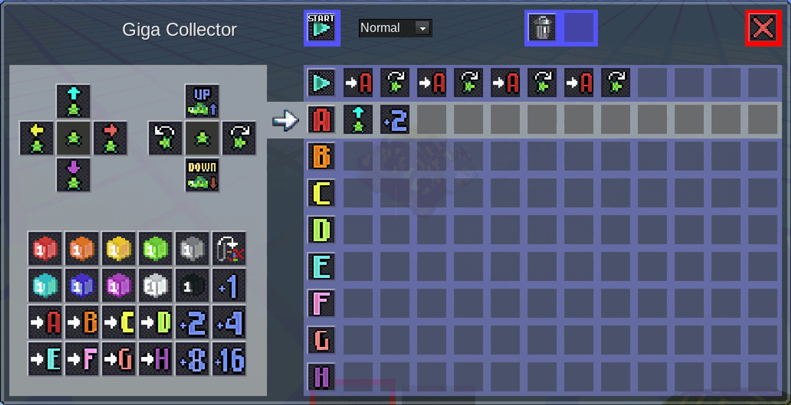
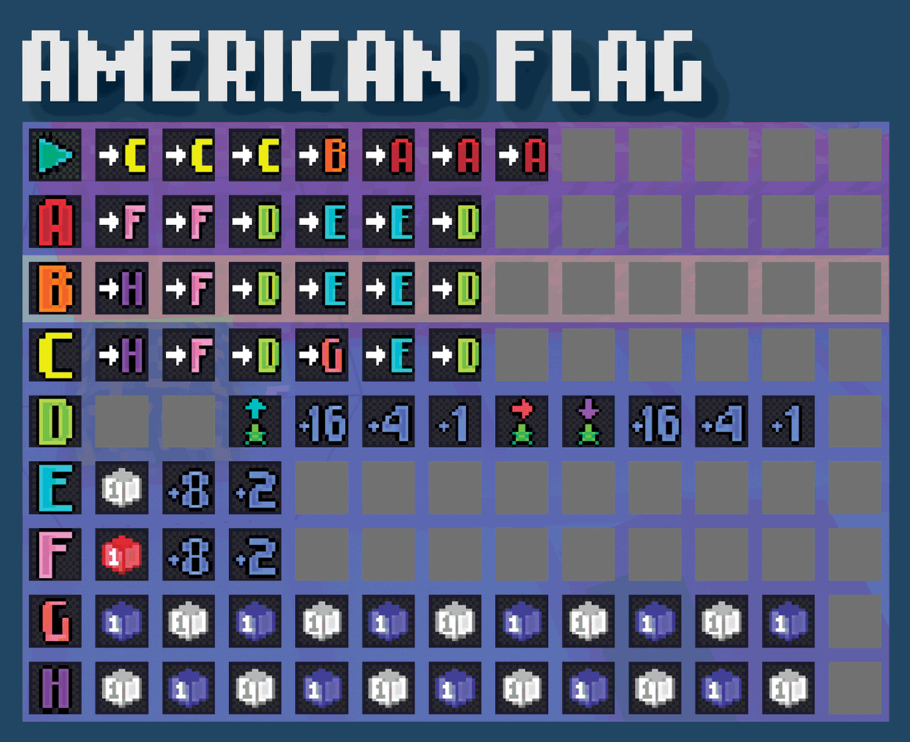
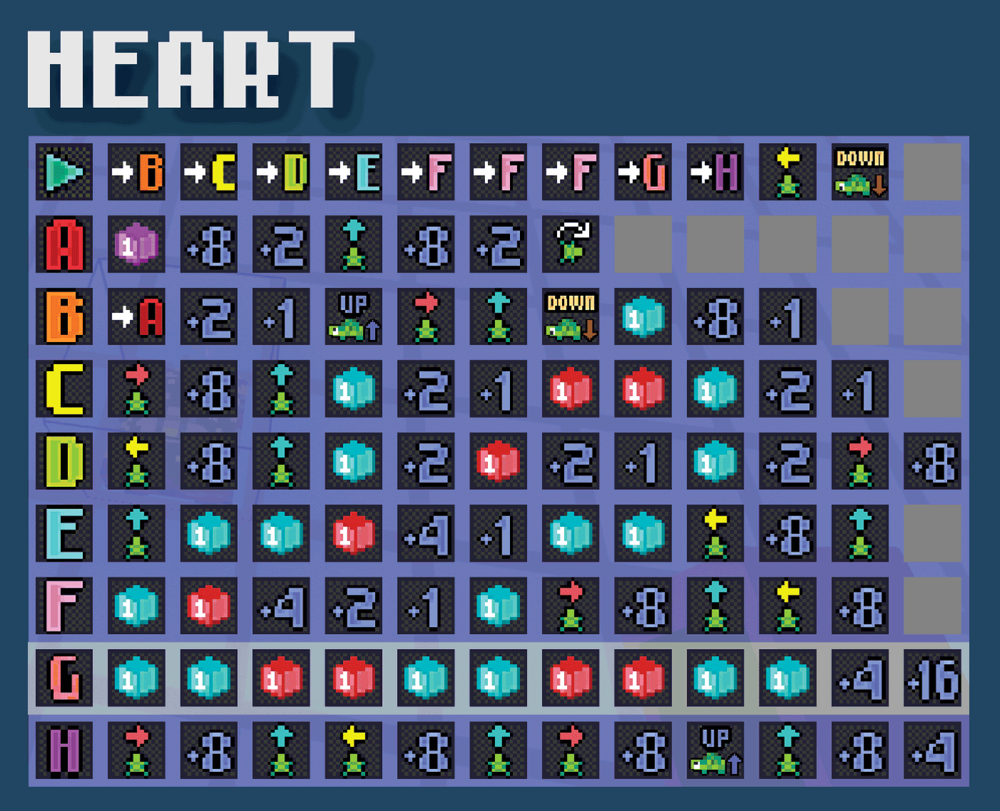
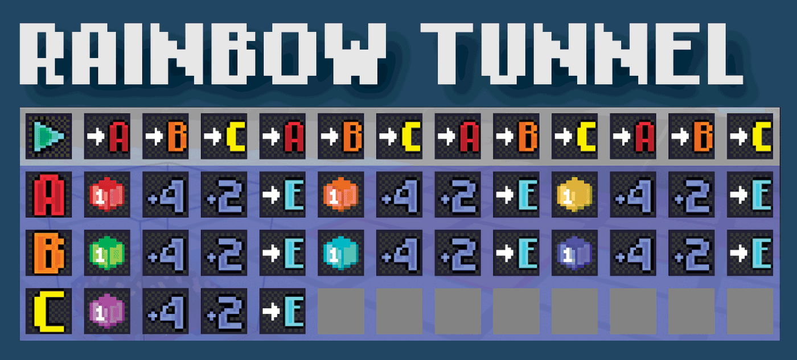
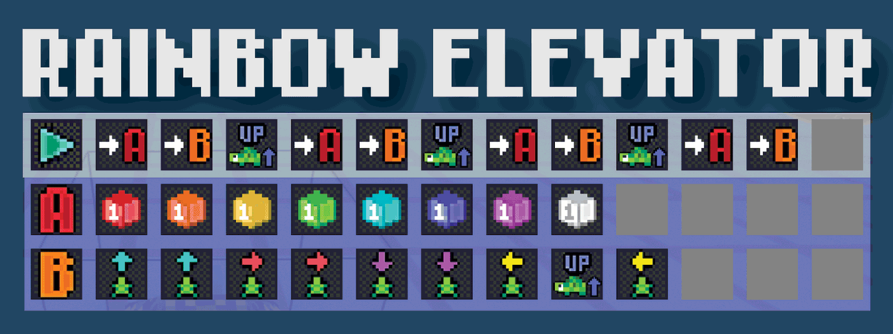
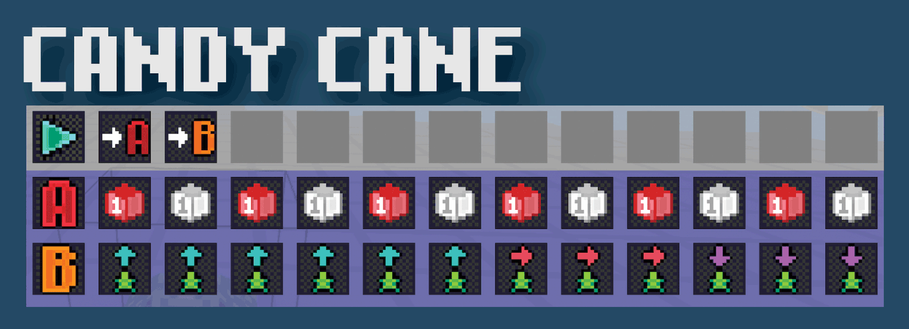
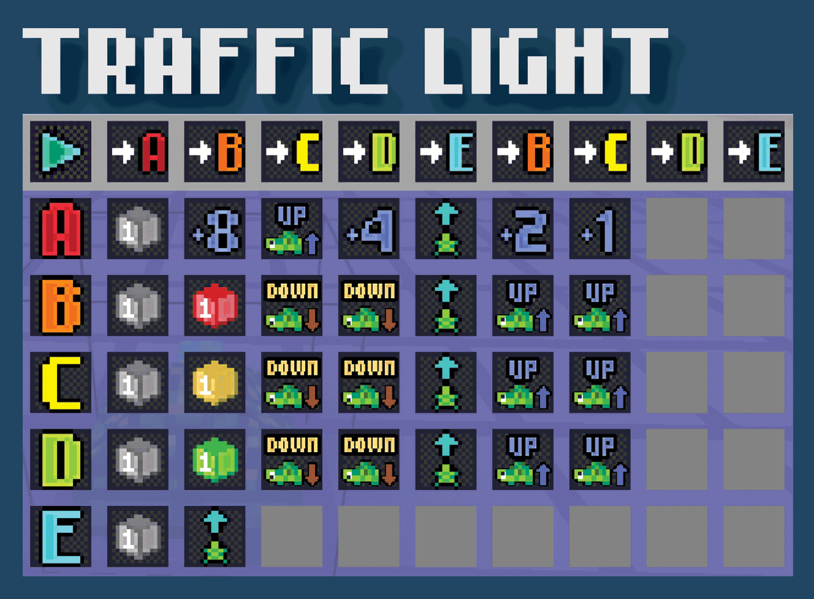
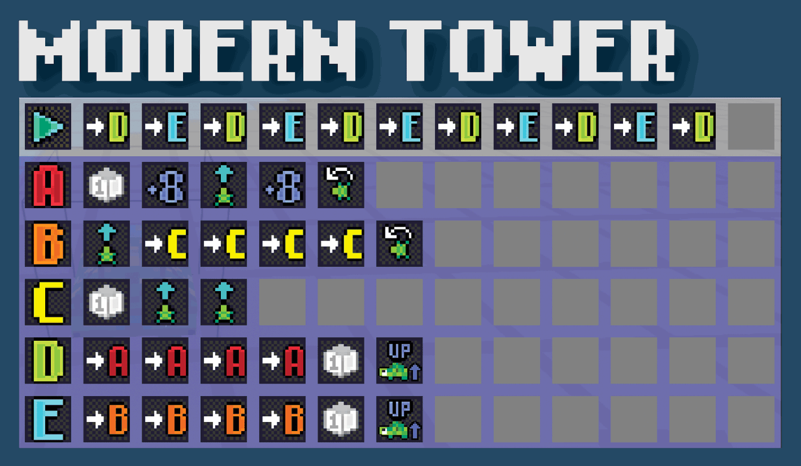
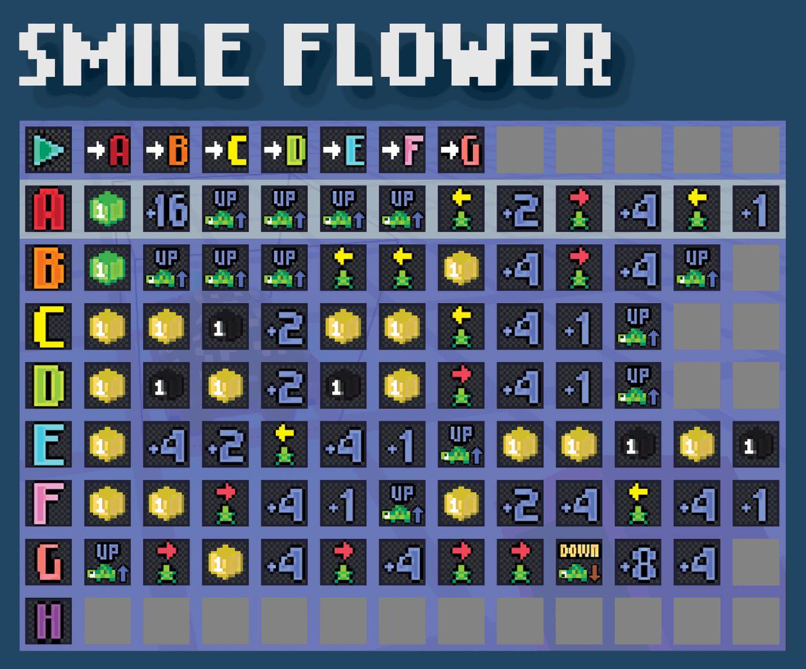
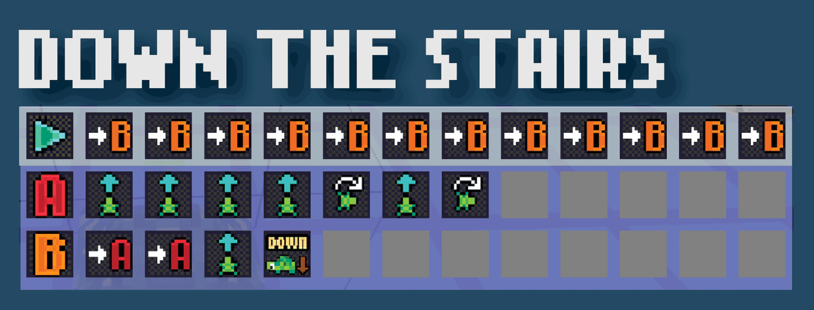

# turtlebots

Turtlebots are programmable bots that can be used to build and dig in Luanti (formerly known as minetest)

## Video Overview

This video provides a quick overview of turtlebots:

<a href ="https://www.youtube.com/watch?v=UR30MB3449k">
  
</a>


## Getting Started

If you want to play turtlebots **without the distractions of other luanti/minetest mods** – a common request for classroom use, there is a standalone game for Luanti that you can download and install here: [Turtlebots Classroom](https://github.com/jmole/turtlebots-classroom)

### Installing Luanti (formerly known as minetest)

Windows/macOS/Linux/Android users can all find detailed instructions for either installing or compiling Luanti from [the official website](https://www.luanti.org/downloads/).

### Installing the Turtlebots Mod

The easiest way to get up and running is:
1) Open Luanti
2) Click on the "Content" tab.
3) Click "Browse Online Content"
4) Search for "turtlebots"
5) Click the turtlebots mod in the search results
6) Click "Install"


<details>
<summary>Installing the Turtlebots Mod from Source</summary>
Otherwise, you can install the mod manually by downloading or cloning the repository into your Luanti/minetest `mods` folder.

On windows, this is typically `%appdata%\.minetest\mods`. On Linux, this is typically `~/.minetest/mods`. On macOS, this is typically `~/Library/Application Support/minetest/mods`. Note that these folders won't exist until you have run Luanti at least once.

```bash
cd ~/Library/Application\ Support/minetest/mods
git clone https://github.com/jmole/turtlebots.git
```

</details>

## How to Play Turtlebots

The turtlebots mod adds a new block called `turtlebots:off` to the game. You can find it in your creative inventory.

If you are using the [turtlebots-classroom game](https://github.com/jmole/turtlebots-classroom), it will automatically be in your hand when you start the game.

You can place a turtlebot on the ground by right clicking a node when you're holding it.

After it's been placed, right clicking the turtlebot will open the turtlebot code window GUI.

### How to Program a Turtlebot

The turtlebot code window GUI has a command palette on the left side, and a code block editor on the right.

To add commands to a program, simply click on the name of the program you want to modify, and click on the commands in the command palette.

Each row in the code block editor is a separate program. When **START** is pressed, the turtlebot will execute the program in the first row (the start program).

For example, the following program will do the following:

1) Call program `A`, moving the turtlebot forward 3 steps (1 +2)
2) Turn right 90 degrees.
3) Call program `A`, moving the turtlebot forward 3 steps (1 +2)
4) Turn right 90 degrees.
5) Call program `A`, moving the turtlebot forward 3 steps (1 +2)
6) Turn right 90 degrees.
7) Call program `A`, moving the turtlebot forward 3 steps (1 +2)
8) Turn right 90 degrees.




### More Sample Programs


















